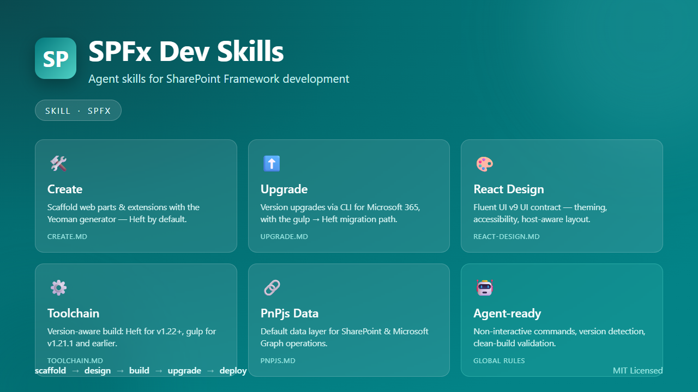

# SPFx Dev Skills

Agent skills for building **SharePoint Framework (SPFx)** solutions — scaffold, design, build, upgrade, and ship, all from your AI coding agent.



> 🚧 **Preview** — expect changes. Skill names, file layout, and guidance are a starting point and will evolve. Outputs are suggestions, not authoritative answers; review them before committing or shipping.

## What's in this repo

A single, focused skill — **`spfx`** — that routes an agent to the right playbook based on what you ask. Each reference is a self-contained, agent-ready guide.

```text
plugins/spfx/skills/spfx/
  SKILL.md                  Router + global rules + the Heft/gulp toolchain decision rule
  references/
    create.md               Scaffold web parts & extensions (Yeoman, Heft by default)
    upgrade.md              Version upgrades (CLI for Microsoft 365) + gulp → Heft migration
    react-design.md         Fluent UI v9 UI contract — theming, accessibility, host-aware layout
    pnpjs.md                PnPjs as the default data layer for SharePoint & Microsoft Graph
```

### The skill: `spfx`

| Capability | Use it when you want to… | Reference |
| --- | --- | --- |
| **Create** | Scaffold a new web part, extension, library, or ACE | [create.md](./plugins/spfx/skills/spfx/references/create.md) |
| **Upgrade** | Move a project to a newer SPFx version | [upgrade.md](./plugins/spfx/skills/spfx/references/upgrade.md) |
| **React Design** | Build or change UI with Fluent UI v9 | [react-design.md](./plugins/spfx/skills/spfx/references/react-design.md) |
| **Toolchain** | Pick Heft (v1.22+) or gulp (≤ v1.21.1) | [SKILL.md](./plugins/spfx/skills/spfx/SKILL.md#toolchain-decision-rule) |
| **PnPjs Data** | Read or write SharePoint / Microsoft Graph data | [pnpjs.md](./plugins/spfx/skills/spfx/references/pnpjs.md) |

### Why these skills?

SPFx development covers a lot of ground — the Yeoman generator, the toolchain switch from gulp to **Heft** at v1.22, Fluent UI theming, accessibility, and data access against SharePoint and Microsoft Graph. AI agents working from generic web context tend to mix toolchain versions, run interactive prompts that hang in a terminal, invent package versions, or stop before validating a build. This skill keeps the agent in the SPFx lane end-to-end: it **detects the installed version**, **picks the correct toolchain**, **uses non-interactive commands**, defaults to **PnPjs** for data, and **validates with a clean build** before calling a task done.

The guidance is informed by repeated evaluation of an SPFx 1.21.1-to-1.22.2 upgrade scenario. Read [Behind SPFx Dev Skills: testing what agents know and fixing what they miss](https://devblogs.microsoft.com/microsoft365dev/behind-spfx-dev-skills-testing-what-agents-know-and-fixing-what-they-miss/) for the baseline, scoring, and resulting changes to the skill, SPFx documentation, and agent content retrieval.

## Use cases

- "Create an SPFx web part that shows my recent documents."
- "Upgrade this solution to the latest SPFx version."
- "Add a Fluent UI v9 card layout to this web part and make it accessible."
- "Read items from the *Projects* list and display them."
- "Migrate this gulp project to the Heft toolchain."

## Install & use

These references follow the portable **skill** convention — a folder with a `SKILL.md` and supporting Markdown that any compatible AI coding agent can load. There are two ways to get the `spfx` skill into your environment.

For the published installation and usage guidance, see [Use the SPFx development skill with AI coding agents](https://learn.microsoft.com/sharepoint/dev/spfx/agent-skills) in the SharePoint developer documentation.

### Option A — Skills CLI (recommended)

A Skills CLI lets you install and manage skills across environments from one command.

```console
# Placeholder — distribution via a Skills CLI is being finalized.
# Once published, installing will be a single command, e.g.:
#   skills install spfx --from SharePoint/spfx-dev-skills
```

> The plugin/marketplace distribution is on the roadmap — see [Roadmap](#roadmap). Until then, use Option B.

### Option B — Manual install

1. Clone this repository:

   ```console
   git clone https://github.com/SharePoint/spfx-dev-skills.git
   ```

2. Copy the skill folder into your agent's skills directory:

   ```text
   plugins/spfx/skills/spfx/   →   <your-agent-skills-directory>/spfx/
   ```

   (Common locations: a `.github/skills/` or `skills/` folder in your workspace, or your agent's global skills directory — check your agent's docs.)
3. Start a new agent session and ask for an SPFx task. The agent loads the matching reference automatically — for example:
   > "Create an SPFx React web part called HelloWorld."

## Roadmap

- A **Skills CLI** install path for one-command setup across environments.
- Plugin/marketplace **distribution** for supported agent hosts.

We'll work on the plugin and distribution pieces next.

## Help us improve

This skill is early and shaped by real usage. If the agent produces something wrong, surprising, or just not as good as it should be, we want to know:

- 🐞 **Open an issue** — describe what you asked, what you expected, and what you got: <https://github.com/SharePoint/spfx-dev-skills/issues>
- 💡 **Suggest improvements** — toolchain guidance, design rules, new references, or distribution mechanics are all fair game.
- 🔧 **Send a pull request** — see [Contributing](#contributing).

Everything you see today — skill scope, structure, the Heft/gulp guidance, the PnPjs default — is a starting point, and your feedback shapes where it lands.

## Contributing

Contributions are welcome! The flow is **fork → branch → PR to `main`**:

1. **Fork** this repository to your own account.
2. Create a feature branch from `main`.
3. Make your changes and validate them (see [CONTRIBUTING.md](./CONTRIBUTING.md)).
4. Open a **pull request against `main`** of `SharePoint/spfx-dev-skills`.

Full guidance — branch model, content conventions, and the review checklist — is in [CONTRIBUTING.md](./CONTRIBUTING.md).

## License

This project is licensed under the **MIT License** — see [LICENSE](./LICENSE) for the full text. You're free to use, modify, and distribute it, including commercially, provided the copyright notice and license are included.
